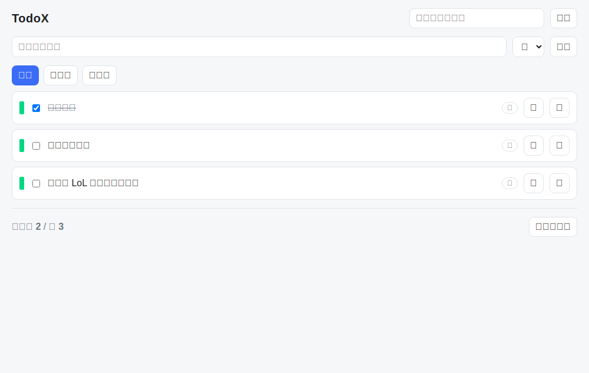
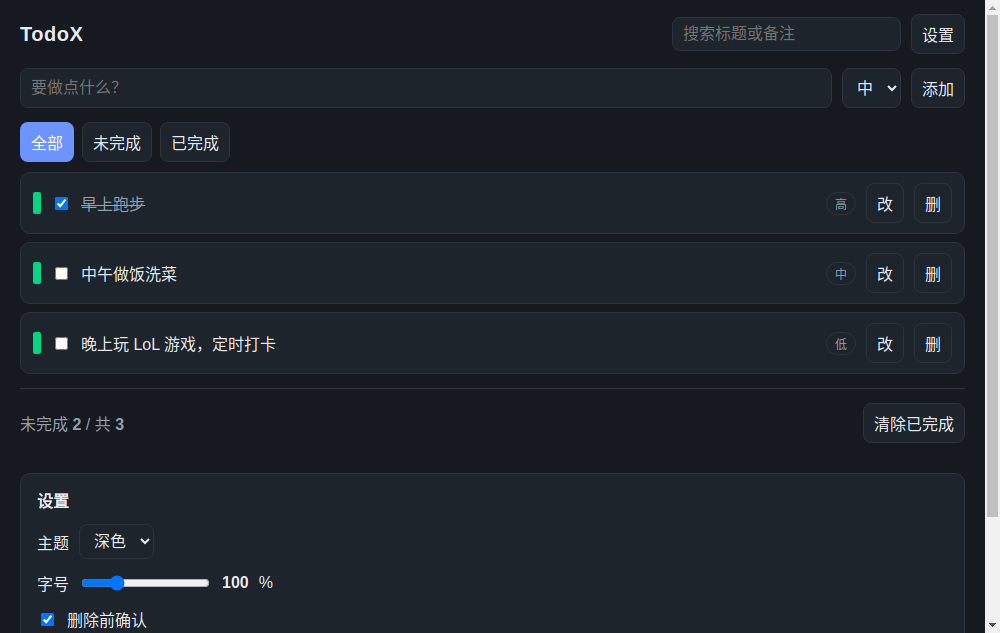

# TodoX

Electron 桌面待办事项应用。Windows / macOS / Linux 三平台，数据全部存在本机。



## 下载

最新版本在 [Releases](https://github.com/supercubegame/TodoX/releases/latest) 页面。

| 平台 | 下载哪个 |
| --- | --- |
| Windows | `TodoX.Setup.<版本>.exe`（安装版）或 `TodoX-<版本>-win.zip`（免安装，解压即用） |
| macOS · Apple 芯片 | `TodoX-<版本>-arm64.dmg` |
| macOS · Intel | `TodoX-<版本>.dmg` |
| Linux | `TodoX-<版本>.AppImage`（`chmod +x` 后直接跑）或 `todox_<版本>_amd64.deb` |

**安装包没有代码签名**（签名需要开发者证书，CI 里拿不到），所以首次打开会被系统拦一次：

- **macOS**：提示「无法验证开发者」。到「系统设置 → 隐私与安全性」点「仍要打开」，
  或者终端里跑 `xattr -dr com.apple.quarantine /Applications/TodoX.app`。
- **Windows**：SmartScreen 拦一次，点「更多信息」→「仍要运行」。

## 功能

**完整增删改查。** 新增、行内改标题、勾选完成、删除（可选二次确认）、一键清除已完成。
每条待办有高 / 中 / 低优先级和备注。

**撤销与重做。** `Ctrl+Z` / `Ctrl+Shift+Z`，最多回退 50 步。撤销只在应用内有效，
不跨重启 —— 那是有意的：历史每一项都是一份完整状态，写进存档会让文件膨胀几十倍。

**搜索与筛选。** 关键词同时匹配标题与备注，忽略大小写；全部 / 未完成 / 已完成三个页签。


**用户设置。** 浅色 / 深色主题、字号 80%–160%、删除前是否确认、默认优先级、默认排序
（创建时间 / 标题 / 优先级）。



**窗口随意调节。** 最小 480x360，尺寸和位置退出后自动记住，下次打开还原。
存档在系统的用户数据目录里（`todox.json`），采用原子写入：先写临时文件再 rename，
断电也不会留下半份 JSON。

## 本地跑起来

```bash
npm install
npm start
```

打包（产物在 `dist/`）：

```bash
npm run pack     # 当前平台，只出目录不出安装包
npm run dist     # 三平台安装包（跨平台打包需要对应环境）
```

需要 Node 20+。

## 项目结构

```
src/core/store.js       纯函数状态核心：CRUD / 查询 / 设置 / 窗口尺寸 / 存档
src/core/history.js     纯函数撤销栈：record / undo / redo / summary
src/main/main.js        主进程：窗口、IPC、持久化编排（唯一的状态所有者）
src/main/persist.js     原子落盘
src/preload/preload.js  contextBridge 暴露的 window.todox
src/renderer/           界面。只渲染 + 发意图，不持有业务规则
```

`src/core/` 不碰任何 I/O：不读文件、不碰 DOM、不发网络、不看系统时间、不用未播种的随机。
时间和 id 由调用方注入。这样同样的输入必然得到同样的输出，逻辑也能换任意外壳复用，
还能在毫秒内压几万步 —— 撤销功能几乎是这条设计白送的：状态本来就不可变，
撤销不需要「反向操作」，只要一个状态栈。

渲染进程跑在 `contextIsolation: true` / `nodeIntegration: false` / `sandbox: true` 下，
只能看见 preload 用 `contextBridge` 显式暴露的方法。

## 验证

每次推送都会跑四条闸门，逐项结果回写到对应提交或 PR 的评论里。任何一条红了，
评论里直接带期望值、实际值和日志尾巴 —— 不用打开 CI 日志。

| 闸门 | 条数 | 验什么 |
| --- | --- | --- |
| 快闸门 | 57 | 纯核心真实行为、撤销栈、纯度扫描、安全不变量、打包配置、四份 workflow 自审。零依赖，十几秒 |
| Electron 端到端 | 21 | 真起 Electron 真点：增删改查、搜索筛选、撤销重做与快捷键、主题字号、窗口 resize、重启恢复、落盘产物、零控制台错误 |
| 性能压测 | 11 | 2000 / 8000 条数据下的稳态延迟、规模比值、存档往返、撤销栈内存 |
| 三平台打包 | 4 × 3 | 三个 runner 上各真打一次包，验产物体积与 `app.asar` |

发布另有一条资产审计：**八个安装包全部上传完成并逐项核对通过之前，Release 一直停在草稿状态。**

```bash
npm run verify       # 快闸门
npm run verify:e2e   # 端到端（Linux 上用 xvfb-run）
npm run verify:perf  # 性能压测
```

性能闸门不写「必须快于 X 毫秒」这种绝对预算：共享 runner 的抖动能到好几倍，
那种断言会先变成随机红，再被一路调宽到永远不会红。它先跑一段确定的参考负载
校准机器速度（预算只放大、不收紧），主力断言是**比值**：数据量翻 4 倍，耗时
不许超过 6 倍。还有一条自证，把同一套测量器套在故意写成二次复杂度的实现上，
要求它必须被判红 —— 一个够不着的阈值和一条空断言是同一个洞。

上面那三张截图不是手工截的，是 CI 里真起一遍 Electron 生成的：喂固定的演示数据，
截图后数像素校验（每行 8x22 的绿色标记条贡献 164 个像素，所以「3 行」必须正好是 492 个），
再核对背景色是否等于该主题的颜色令牌。截图对不上就不许提交,
否则 README 里挂的可能是一张黑图。

改代码之前先读 [AGENTS.md](AGENTS.md)。

## 许可证

MIT
